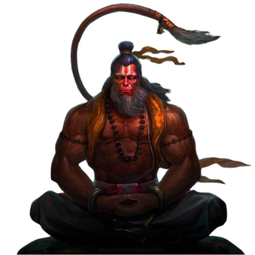

# Hanuman

The elephant-headed god of wisdom and new beginnings.

# Sudharshan

The divine hero of the Bhagavad Gita and avatar of Vishnu.

# Panchajanya

The destroyer and transformer among the Trimurti.
